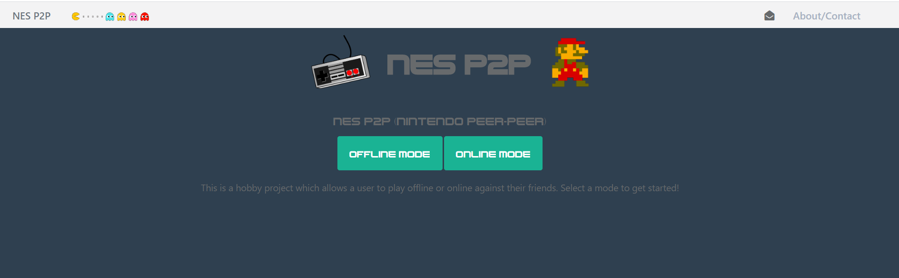
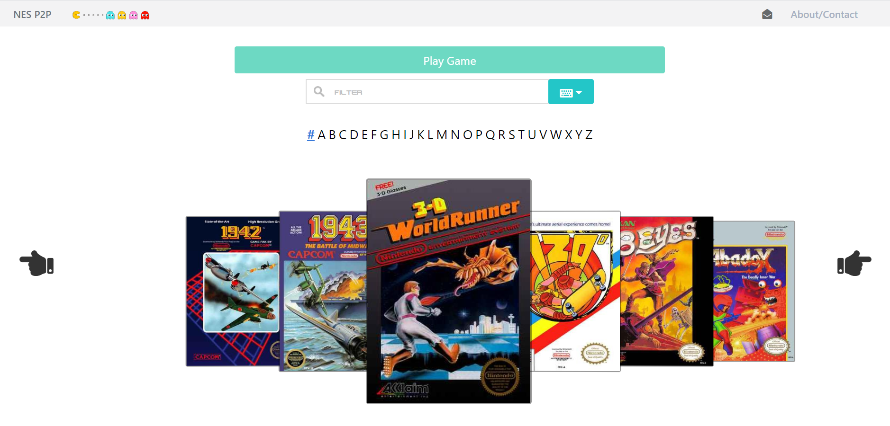
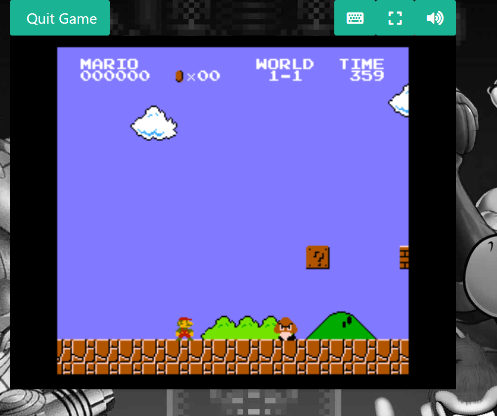

# NesP2P

This project was generated with [Angular CLI](https://github.com/angular/angular-cli) version 1.5.4.

## What is NES P2P?

This is a P2P Online Multiplayer NES experience. Allows a user to either play a game offline or go into the online mode and wait in the lobby for another user to invite.

Try it out at: https://nesp2p.com

## Tecnology Stack

This is a node.js application. The following is a list of all components and the technology its built on.
- Front-end: Angular CLI (v. 6)
- Data API: Express.js
- Database: MySQL
- Toolset Pipeline: C#/.NET
- Remote WebSockets: TURN Server (COTURN)

## Landing Page

The landing page was made to be simple and to the point. You'll find two options. Offline and Online mode.

## Game Select Page

As the name eludes to, you can select a game here to play. A bit fancy but effective is the selection carousel.  With some optimizations both the scrolling as well as the filtering have no latency.  All of these assets were built with the toolset pipeline.

## Game Play Page

Where the action takes place. Once the game is selected, the user will enter the game play page. The following features were implemented:

- Fullscreen support
- Audio mute support
- Keyboard mapping
- Controller mapping
- Multiplayer support
- Mobile support
- Webcam/audio support (online only)
- Lobby: Choose from a list of users to play a game with (online only)
- Email invitation to friends

## Outstanding Issues

- Further TURN server configuration is needed so only peers on the same network will be able to connect for Online Multiplayer mode.
- A mobile implmentation was created but the controls are a bit flaky and needs to be turned into a native mobile application for better "touch" support.

## Development server

Run `ng serve` for a dev server. Navigate to `http://localhost:4200/`. The app will automatically reload if you change any of the source files.

## Code scaffolding

Run `ng generate component component-name` to generate a new component. You can also use `ng generate directive|pipe|service|class|guard|interface|enum|module`.

## Build

Run `ng build` to build the project. The build artifacts will be stored in the `dist/` directory. Use the `-prod` flag for a production build.

## Running unit tests

Run `ng test` to execute the unit tests via [Karma](https://karma-runner.github.io).

## Running end-to-end tests

Run `ng e2e` to execute the end-to-end tests via [Protractor](http://www.protractortest.org/).

## Further help

To get more help on the Angular CLI use `ng help` or go check out the [Angular CLI README](https://github.com/angular/angular-cli/blob/master/README.md).
